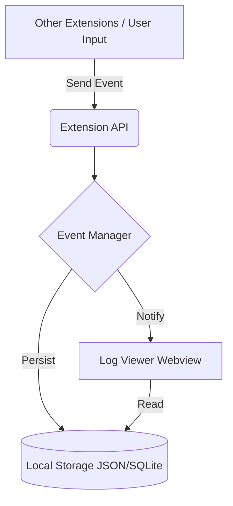

# Reasoning Logger - Design Plan

## Overview
The **Reasoning Logger** is a VS Code extension designed to capture, store, and visualize AI reasoning events. It serves as a black box recorder for AI interactions, helping developers debug, analyze, and improve AI model performance within their IDE.

## Core Features

### 1. Event Logging
- **Capture**: Intercept or receive AI events (prompts, completions, internal thoughts/reasoning traces).
- **Storage**: Persist events to a local JSONL file or a dedicated SQLite database for efficient querying.
- **Context**: Capture IDE context (active file, cursor position, selection) associated with each event.

### 2. Data Model
- **Session**: Group events into sessions (e.g., a single chat conversation or a specific task).
- **Event Types**:
    - `user_prompt`: Input from the user.
    - `model_thought`: Internal reasoning or chain-of-thought from the AI.
    - `model_response`: Final output from the AI.
    - `tool_call`: Function calls made by the AI.
    - `tool_result`: Output from executed tools.

### 3. Visualization (UI)
- **Log Viewer**: A dedicated Webview panel to browse logs.
- **Filtering**: Filter by session, event type, or keyword.
- **Timeline**: Visual representation of the sequence of events.
- **Diff View**: Compare prompt vs. response or different iterations.

### 4. Integration
- **API**: Expose an API for other extensions to send events to the logger.
- **Commands**: VS Code commands to manually log events or open the viewer.

## Architecture

## Future Scope
- Cloud sync for team collaboration.
- Analytics dashboard (token usage, latency stats).
- Replay mechanism to re-run sessions.
